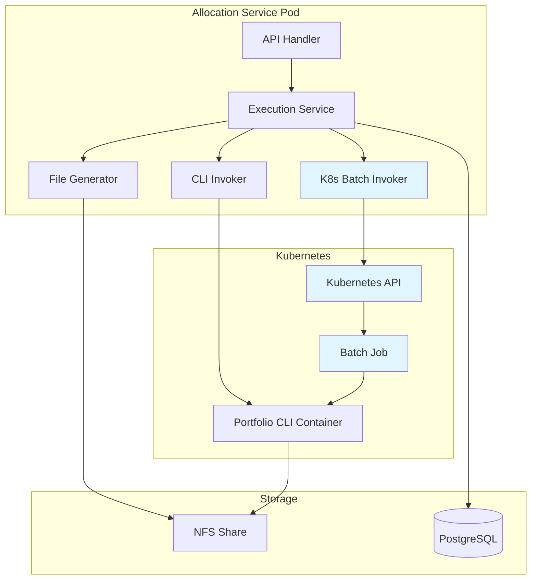

# Design Document

## Overview

This design transforms the Portfolio Accounting CLI invocation mechanism from direct os/exec calls to Kubernetes batch jobs. The current system generates files on a NAS share and executes CLI commands directly using os/exec. The enhanced system will provide an option to dynamically create and submit Kubernetes batch jobs for CLI execution, offering better scalability, monitoring, and retry capabilities.

The design maintains backward compatibility with the existing direct execution method while adding new Kubernetes-native capabilities through configuration options and new API endpoints.

## Architecture

### High-Level Architecture



### Component Interaction Flow

1. **File Generation**: Service generates Portfolio Accounting files on NFS share
2. **Invocation Choice**: Based on configuration, choose between direct CLI execution or Kubernetes batch job
3. **Batch Job Creation**: For K8s mode, dynamically create job manifests and submit to Kubernetes API
4. **Job Monitoring**: Monitor job status and wait for completion
5. **Status Reporting**: Return appropriate HTTP status codes based on job success/failure
6. **File Cleanup**: Clean up files only on successful job completion (if enabled)

## Components and Interfaces

### 1. Kubernetes Batch Invoker Service

**Purpose**: Manages Kubernetes batch job creation, submission, and monitoring for CLI execution.

**Interface**:
```go
type KubernetesBatchInvoker interface {
    InvokePortfolioAccountingCLI(ctx context.Context, filename string, outputDir string) error
    RetryBatchJob(ctx context.Context, filename string, outputDir string) error
    ValidateKubernetesAccess() error
}
```

**Key Methods**:
- `InvokePortfolioAccountingCLI`: Creates and submits batch job for CLI execution
- `RetryBatchJob`: Retries failed batch jobs without regenerating files
- `ValidateKubernetesAccess`: Validates RBAC permissions and connectivity

### 2. Enhanced Execution Service

**Purpose**: Orchestrates the execution flow with support for both direct and Kubernetes batch invocation.

**New Methods**:
```go
func (s *ExecutionService) SendWithKubernetes(ctx context.Context) (*domain.SendResponse, error)
func (s *ExecutionService) RetryExecution(ctx context.Context, filename string) (*domain.SendResponse, error)
func (s *ExecutionService) DeleteLastBatchHistory(ctx context.Context) error
```

### 3. New API Endpoints

#### POST /api/v1/executions/send/retry
**Purpose**: Retry batch job execution for a specific file without regenerating it.

**Request Body**:
```json
{
  "filename": "executions_20240130_143022.csv"
}
```

**Response**:
```json
{
  "status": "success",
  "message": "Batch job completed successfully",
  "filename": "executions_20240130_143022.csv",
  "job_name": "portfolio-cli-retry-1706627422"
}
```

#### POST /api/v1/executions/send/delete_last
**Purpose**: Delete the last batch history record to allow complete rerun.

**Response**:
```json
{
  "status": "success",
  "message": "Last batch history record deleted",
  "deleted_batch_id": 42
}
```

### 4. Configuration Enhancement

**New Configuration Options**:
```go
type Config struct {
    // Existing fields...
    
    // Kubernetes batch job configuration
    KubernetesBatchEnabled bool   `mapstructure:"kubernetes_batch_enabled"`
    KubernetesNamespace    string `mapstructure:"kubernetes_namespace"`
    CLIImage              string `mapstructure:"cli_image"`
    JobTimeout            int    `mapstructure:"job_timeout_seconds"`
    JobRetryLimit         int    `mapstructure:"job_retry_limit"`
    
    // Service account configuration
    ServiceAccountName string `mapstructure:"service_account_name"`
}
```

## Data Models

### 1. Batch Job Configuration

```go
type BatchJobConfig struct {
    JobName           string
    Namespace         string
    Image             string
    Filename          string
    OutputDir         string
    ServiceAccount    string
    Timeout           time.Duration
    RetryLimit        int32
    NFSVolumeClaim    string
}
```

### 2. Job Status Tracking

```go
type JobStatus struct {
    JobName     string
    Status      string // "pending", "running", "succeeded", "failed"
    StartTime   time.Time
    EndTime     *time.Time
    Message     string
    PodName     string
}
```

### 3. Enhanced Send Response

```go
type SendResponse struct {
    ProcessedCount int    `json:"processed_count"`
    FileName       string `json:"filename"`
    Status         string `json:"status"`
    Message        string `json:"message"`
    
    // New fields for Kubernetes batch jobs
    JobName        *string `json:"job_name,omitempty"`
    JobStatus      *string `json:"job_status,omitempty"`
    ExecutionMode  string  `json:"execution_mode"` // "direct" or "kubernetes"
}
```

## Error Handling

### 1. Kubernetes API Errors

**Connection Issues**:
- Retry with exponential backoff
- Fallback to direct execution if configured
- Log detailed error information for debugging

**RBAC Permission Errors**:
- Validate permissions on startup
- Provide clear error messages for missing permissions
- Document required RBAC configuration

### 2. Job Execution Errors

**Job Creation Failures**:
- Validate job manifest before submission
- Check resource quotas and limits
- Provide detailed error messages

**Job Runtime Failures**:
- Monitor job status and capture pod logs
- Distinguish between infrastructure and application failures
- Implement retry logic for transient failures

### 3. File Access Errors

**NFS Mount Issues**:
- Validate NFS accessibility from both service and job pods
- Provide clear error messages for mount failures
- Test file read/write permissions

## Testing Strategy

### 1. Unit Tests

**Kubernetes Batch Invoker**:
- Mock Kubernetes client for job creation/monitoring
- Test job manifest generation
- Test error handling scenarios
- Test retry logic

**Enhanced Execution Service**:
- Test new endpoint handlers
- Test configuration-based execution mode selection
- Test batch history deletion logic

### 2. Integration Tests (Manual in Kubernetes)

**Phase 1: Basic Job Creation**
- Verify service can create and submit batch jobs
- Test RBAC permissions
- Validate NFS mount accessibility

**Phase 2: End-to-End Flow**
- Test complete execution flow with Kubernetes batch jobs
- Verify file generation and CLI execution
- Test job monitoring and status reporting

**Phase 3: Error Scenarios**
- Test job failure handling
- Test retry functionality
- Test file cleanup behavior

**Phase 4: New API Endpoints**
- Test retry endpoint with existing files
- Test batch history deletion endpoint
- Validate API documentation and OpenAPI spec

### 3. Performance Tests

**Job Creation Performance**:
- Measure job creation and submission time
- Test concurrent job submissions
- Monitor resource usage

**Monitoring Overhead**:
- Measure impact of job status polling
- Test timeout handling
- Validate cleanup of completed jobs

## Kubernetes RBAC Configuration

### 1. Service Account

```yaml
apiVersion: v1
kind: ServiceAccount
metadata:
  name: globeco-allocation-service
  namespace: globeco
```

### 2. Role

```yaml
apiVersion: rbac.authorization.k8s.io/v1
kind: Role
metadata:
  namespace: globeco
  name: batch-job-manager
rules:
- apiGroups: ["batch"]
  resources: ["jobs"]
  verbs: ["create", "get", "list", "watch", "delete"]
- apiGroups: [""]
  resources: ["pods"]
  verbs: ["get", "list", "watch"]
- apiGroups: [""]
  resources: ["pods/log"]
  verbs: ["get"]
```

### 3. RoleBinding

```yaml
apiVersion: rbac.authorization.k8s.io/v1
kind: RoleBinding
metadata:
  name: allocation-service-batch-jobs
  namespace: globeco
subjects:
- kind: ServiceAccount
  name: globeco-allocation-service
  namespace: globeco
roleRef:
  kind: Role
  name: batch-job-manager
  apiGroup: rbac.authorization.k8s.io
```

## Batch Job Template

### Job Manifest Template

```yaml
apiVersion: batch/v1
kind: Job
metadata:
  name: "portfolio-cli-{{.Timestamp}}"
  namespace: globeco
  labels:
    app: portfolio-accounting-cli
    component: batch-processor
    managed-by: globeco-allocation-service
spec:
  ttlSecondsAfterFinished: 3600  # Clean up after 1 hour
  backoffLimit: 2
  activeDeadlineSeconds: 1800    # 30 minute timeout
  template:
    metadata:
      labels:
        app: portfolio-accounting-cli
        job-name: "portfolio-cli-{{.Timestamp}}"
    spec:
      restartPolicy: Never
      serviceAccountName: globeco-allocation-service
      containers:
      - name: portfolio-cli
        image: "{{.CLIImage}}"
        command: ["/usr/local/bin/cli"]
        args:
          - "process"
          - "--file"
          - "/data/{{.Filename}}"
          - "--output-dir"
          - "/data"
          - "--config"
          - "/etc/config/config.yaml"
        volumeMounts:
        - name: nfs-storage
          mountPath: /data
          readOnly: false
        - name: cli-config
          mountPath: /etc/config
        env:
        - name: GLOBECO_PA_SERVER_HOST
          value: "globeco-allocation-service"
        - name: GLOBECO_PA_SERVER_PORT
          value: "8089"
        resources:
          requests:
            memory: "512Mi"
            cpu: "250m"
          limits:
            memory: "1Gi"
            cpu: "500m"
      volumes:
      - name: nfs-storage
        persistentVolumeClaim:
          claimName: nfs-pvc
      - name: cli-config
        configMap:
          name: portfolio-cli-config
```

## Implementation Phases

### Phase 1: Core Infrastructure
1. Implement Kubernetes client integration
2. Create batch job invoker service
3. Add configuration options for Kubernetes mode
4. Implement basic job creation and monitoring

### Phase 2: Enhanced Execution Service
1. Modify execution service to support both execution modes
2. Implement job status monitoring and error handling
3. Add retry logic for failed jobs
4. Implement file cleanup logic for successful jobs

### Phase 3: New API Endpoints
1. Implement retry endpoint (`/api/v1/executions/send/retry`)
2. Implement batch history deletion endpoint (`/api/v1/executions/send/delete_last`)
3. Update API documentation and OpenAPI specification
4. Add comprehensive error handling and validation

### Phase 4: RBAC and Deployment
1. Create Kubernetes RBAC manifests
2. Update deployment configuration
3. Add service account and role bindings
4. Test RBAC permissions and access

### Phase 5: Integration Testing
1. Manual testing in Kubernetes environment
2. End-to-end flow validation
3. Error scenario testing
4. Performance validation

This design provides a comprehensive approach to implementing Kubernetes batch job support while maintaining backward compatibility and providing robust error handling and monitoring capabilities.