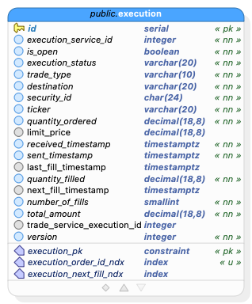

# GlobeCo Allocation Service Requirements

## Background

This document provides requirements for the Allocation Service.  This service is designed to take output from the conversation service and prepare files to feed the Portfolio Accounting Service.  

This microservice will be deployed on Kubernetes 1.33.

This microservice is part of the GlobeCo suite of applications for benchmarking Kubernetes autoscaling.

- Name of service: Allocation Service
- Host: globeco-allocation service
- Port: 8089 

- Author: Noah Krieger 
- Email: noah@kasbench.org

## Technology

| Technology | Version | Notes |
|---------------------------|----------------|---------------------------------------|
| Go | 23.4 | |
| PostgreSQL | 17 | |
---
See 


## Other services

| Name | Host | Port | Description | OpenAPI Schema |
| --- | --- | --- | --- | --- |
| Portfolio Accounting Service CLI | globeco-portfolio-accounting-service-cli | N/A | CLI | [CLI-Usage_Guide.md](CLI-Usage-Guide.md)|
| Trade Service | globeco-trade-service | 8082 | |  [trade-service-openapi.json](trade-service-openapi.json)


---


## Database Information

The database is at globeco-allocation-service-postgresql:5432
The database is the default `postgres` database.
The schema is the default `public` schema.
The owner of all database objects is `postgres`.


## Entity Relationship Diagram




## Data dictionary 

### Database: postgres

### Tables

## _public_.**execution** `Table`
| Name | Data type  | PK | FK | UQ  | Not null | Default value | Description |
| --- | --- | :---: | :---: | :---: | :---: | --- | --- |
| id | serial | &#10003; |  |  | &#10003; |  |  |
| execution_service_id | integer | | | &#10003; | &#10003;
| is_open | boolean |  |  |  | &#10003; | true |  |
| execution_status | varchar(20) |  |  |  | &#10003; |  |  |
| trade_type | varchar(10) |  |  |  | &#10003; |  |  |
| destination | varchar(20) |  |  |  | &#10003; |  |  |
| trade_date | date|  |  |  | &#10003; |  |  |
| security_id | char(24) |  |  |  | &#10003; |  |  |
| ticker | varchar(20) |  |  |  | &#10003; |  |  |
| portfolio_id| char(24) | | | | 
| quantity | decimal(18,8) |  |  |  | &#10003; |  |  |
| received_timestamp | timestamptz |  |  |  | &#10003; |  |  |
| sent_timestamp | timestamptz |  |  |  | &#10003; |  |  |
| last_fill_timestamp | timestamptz |  |  |  |  |  |  |
| quantity_filled | decimal(18,8) |  |  |  | &#10003; | 0 |  |
| total_amount | decimal(18,8) |  |  |  | | 0 |  |
| average_price | decimal(18,8) | | | | &#10003; |
| ready_to_send_timestamp | timestamptz ||||| CURRENT_TIMESTAMP | Time record was ready to send to Portfolio Accounting
| version | integer |  |  |  | &#10003; | 1 |  |

#### Constraints
| Name | Type | Column(s) | References | On Update | On Delete | Expression | Description |
|  --- | --- | --- | --- | --- | --- | --- | --- |
| execution_pk | PRIMARY KEY | id |  |  |  |  |  |

#### Indexes
| Name | Type | Column(s) | Expression(s) | Predicate | Description |
|  --- | --- | --- | --- | --- | --- |
| execution_order_id_ndx | btree | order_id |  |  |  |
| execution_next_fill_ndx | btree | next_fill_timestamp |  |  |  |

---

## _public_.**batch_history** `Table`
| Name | Data type  | PK | FK | UQ  | Not null | Default value | Description |
| --- | --- | :---: | :---: | :---: | :---: | --- | --- |
| id | serial | &#10003; |  |  | &#10003; |  |  |
| start_time | timestamptz | | |&#10003; | &#10003;| CURRENT_TIMESTAMP
| previous_start_time | timestamptz | | |&#10003; | &#10003;
| version | integer |  |  |  | &#10003; | 1 |  |


#### Constraints
| Name | Type | Column(s) | References | On Update | On Delete | Expression | Description |
|  --- | --- | --- | --- | --- | --- | --- | --- |
| batch_history_pk | PRIMARY KEY | id |  |  |  |  |  |

#### Indexes
| Name | Type | Column(s) | Expression(s) | Predicate | Description |
|  --- | --- | --- | --- | --- | --- |
| batch_history_start_time_ndx | btree | start_time |  |  | Unique indexx |
| batch_history_previous_start_time_ndx | btree | previous_start_time |  |  | Unique index |


## DTO

DTO: ExecutionDTO

| Field           | Type    | Nullable | execution table column         |
|-----------------|---------|----------|------------------------------------|
| id | Integer | No | id |
| executionServiceId | Integer | No | execution_service_id |
| isOpen | Boolean | No | is_open |
| executionStatus | String | No | execution_status |
| tradeType | String | No | trade_type |
| destination | String | No | destination |
| securityId | String | No | security_id |
| portfolioId | String | No | portfolio_id |
| ticker | String | No | ticker
| quantity | BigDecimal | No | quantity
| limitPrice | BigDecimal | Yes | limit_price
| receivedTimestamp | OffsetDateTime  | No | received_timestamp |
| sentTimestamp | OffsetDateTime | No | sent_timestamp |
| lastFilledTimestamp | OffsetDateTime | No | last_fill_timestamp |
| quantityFilled | BigDecmial | No | quantity_filled
| totalAmount| BigDecimal | No | total_amount |
| averagePrice | BigDecimal | No | average_price |
| version         | Integer | No       | version  |


DTO: ExecutionPostDTO

| Field           | Type    | Nullable | execution table column         |
|-----------------|---------|----------|------------------------------------|
| executionServiceId | Integer | No | execution_service_id |
| orderId | Integer | No | order_id |
| isOpen | Boolean | No | is_open |
| executionStatus | String | No | execution_status |
| tradeType | String | No | trade_type |
| destination | String | No | destination |
| securityId | String | No | security_id
| ticker | String | No | ticker
| quantity | BigDecimal | No | quantity
| limitPrice | BigDecimal | Yes | limit_price
| receivedTimestamp | OffsetDateTime  | No | received_timestamp |
| sentTimestamp | OffsetDateTime | No | sent_timestamp |
| lastFilledTimestamp | OffsetDateTime | No | last_fill_timestamp |
| quantityFilled | BigDecmial | No | quantity_filled
| totalAmount| BigDecimal | No | total_amount |
| averagePrice | BigDecimal | No | average_price |


## REST API Documentation


| Method | Path                  | Request Body         | Response Body        | Description                       |
|--------|-----------------------|---------------------|----------------------|-----------------------------------|
| GET    | /api/v1/executions      |                     | [ExecutionDTO]         | List all executions.  Implement paging with limit and offset fields   |
| GET    | /api/v1/execution/{id} |                     | ExecutionDTO           | Get an execution by ID               |
| POST   | /api/v1/executions | [ExecutionPostDTO] | Model response DTO after **POST** `/executions/batch` in [SAMPLE_API_DOCUMENTATION.md](SAMPLE_API_DOCUMENTATION.md) | Posts up to 100 Executions 
| POST | /api/vi/executions/send |  |  | Generates a file in the format of Portfolio Accounting CLI as documented in the [CLI-Usage_Guide.md](CLI-Usage-Guide.md) and invokes the CLI

Model the response codes after [SAMPLE_API_DOCUMENTATION.md](SAMPLE_API_DOCUMENTATION.md)


### Processing Logic

#### POST /api/v1/executions 

For each record:

- Examine isOpen on DTO.  If isOpen is true, skip this record.  Do not persist to the database.  We will only process closed records.  

- Call GET /api/v2/executions on the Trade Service passing executionServiceId from the DTO as the query parameter executionServiceId.  You will use portfolioId in the next step.  The following is a sample response DTO from GET /api/v2/executions on the Trade Service.

```json
{
  "executions": [
    {
      "id": 15,
      "executionTimestamp": "2025-06-17T16:30:05.519712Z",
      "executionStatus": {
        "id": 4,
        "abbreviation": "FULL",
        "description": "Filled",
        "version": 1
      },
      "blotter": null,
      "tradeType": {
        "id": 1,
        "abbreviation": "BUY",
        "description": "Buy",
        "version": 1
      },
      "tradeOrder": {
        "id": 148,
        "orderId": 148,
        "portfolio": {
          "portfolioId": "684f125ac19ad4fb89bc14ba",
          "name": "Portfolio 9733"
        },
        "security": {
          "securityId": "684f122eeea39200e56291b8",
          "ticker": "LYB"
        }
      },
      "destination": {
        "id": 1,
        "abbreviation": "ML",
        "description": "Merrill Lynch",
        "version": 1
      },
      "quantityOrdered": 371,
      "quantityPlaced": 371,
      "quantityFilled": 371,
      "limitPrice": null,
      "executionServiceId": 2,
      "version": 3
    }
  ],
  "pagination": {
    "totalElements": 1,
    "totalPages": 1,
    "currentPage": 0,
    "pageSize": 50,
    "hasNext": false,
    "hasPrevious": false
  }
}
```
- Insert a record in the the execution table using the following mapping:

| Name | Mapping |
| --- | --- | 
| id | Autogenerated
| execution_service_id |  executionServiceId from DTO
| is_open | false
| execution_status | executionStatus from DTO
| trade_type |  tradeType from DTO
| destination | destination from DTO
| trade_date | Today's Date (this may be changed in the future)
| security_id | securityId from DTO
| ticker | ticker from DTO
| portfolio_id | portfolioId from the previous step
| quantity | quantity from DTO
| received_timestamp | receivedTimestamp from DTO
| sent_timestamp |  sentTimestamp from DTO
| last_fill_timestamp | lastFillTimestamp from DTO
| quantity_filled | quantityFilled from DTO
| total_amount | totalAmount from DTO
| average_price | averagePrice from DTO
| ready_to_send_timestamp | Current timestamp at the moment the record is saved based on database time.  Use database column default.  Do not override the default value with null or any other value. 
| version | 1


#### POST /api/v1/executions/send

**NOTE**: The following algorithm is designed to prevent two simultaneous posts from sending the same duplicate records to the Portfolio Accounting Service.

- Get the max(start_time) from `batch_history`
- Insert the following record into the batch history table
    | column | value |
    | --- | --- |
    | id | autogenerated |
    | start_time | column default value of CURRENT_TIMESTAMP.  Do not override the default value with null or any other value.
    | previous_start_time | the max(start_time) from the previous step 
    | version | 1 
    
    If the insert fails because of a uniqueness constraint on the previous_start_time, it means that a duplicate process has already started.  Return a 400 level error with an appropriate message.
- Select all execution records where ready_to_send_timestamp greater than or equal to the previous_start_time and less than the start_time from the previous step
- Format the records according the the [CLI-Usage-Guide.md](CLI-Usage-Guide.md) using the following mapping:
    | Column | Mapping (from `execution` table unless otherwise specified)
    |--------|------|
    | `portfolio_id` | portfolio_id
    | `security_id` | security_id
    | `source_id` | Concatenate the literal constant "AC" and the `id` column as a string
    | `transaction_type` |  transaction_type
    | `quantity` | quantity
    | `price` | average_price
    | `transaction_date` | trade_date

- Directory /usr/local/share/files will be mounted to both the Portfolio Accounting CLI and the Allocation Service.  It should be used as the output of the Allocation Service and input to the Portfolio Accounting Service CLI.  Make this location configurable so that it can be easily changed.
- Invoke the CLI.  The CLI will either be running in Docker (for development) or Kubernetes (production).  Provide configuration for both.
- Return appropriate error codes.


## Non-Functional Requirements

- Clean Architecture, DDD, modular layering
- **PostgreSQL Persistence:** Robust schema, migrations, and repository pattern
- **REST API:** Query executions, health checks, OpenAPI/Swagger UI
- **Observability:**
  - Structured logging (zap)
  - Prometheus metrics (`/metrics`)
  - OpenTelemetry tracing
- **Health Checks:** Liveness (`/healthz`), readiness (`/readyz`)
- **Config Management:** Viper-based, environment-driven
- **Testing:** Unit, integration, and Kafka tests with testcontainers
- **Security:** Input validation, CORS, environment-based secrets
- **Containerization:** Multi-arch Dockerfile, Kubernetes manifests, CI/CD
- **Timestamps:** All timestamps in API and Kafka messages are encoded as `float64` seconds since epoch (e.g., `1748345329.233793461`), not ISO8601 strings.

### CI/CD
- GitHub Actions workflow for multi-arch Docker builds and pushes
- Requires DockerHub credentials as secrets

## Observability
- **Metrics:** `/metrics` (Prometheus)
- **Tracing:** OpenTelemetry (stdout exporter by default)
- **Logging:** zap, structured, environment-aware

## Security
- Input validation on all endpoints
- CORS enabled (adjust for production)
- Secrets/config via environment variables

Resiliency features such as retries, exponential backoff, circuit breaker

Docker compose is not required.  All required databases and services are already deployed.  We only need a Dockerfile.

